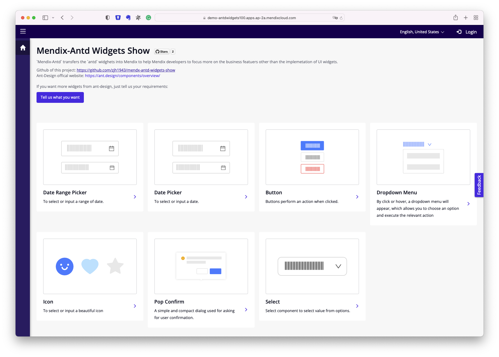

# mendx-antd-widgets-show
A Mendix project to show all the Mendix pluggable widgets from `Mendix-Antd` project. `Mendix-Antd` is a project to migrate most of the useful widgets from Ant Design (which is a very popular reactjs widgets library) to Mendix world. 

Go to [here](https://demo-antdwidgets100.apps.ap-2a.mendixcloud.com/) to view the web applciation deployed from this project.

> We make this project public to allow users of these widgets to learn the using method of these widgets.

# Widget List

Here is the widget list:

<table class="tg">
<thead>
  <tr>
    <th class="tg-7btt">Widget  </th>
    <th class="tg-7btt">Github </th>
    <th class="tg-7btt">Status </th>
    <th class="tg-7btt">Owner </th>
  </tr>
</thead>
<tbody>
  <tr>
    <td class="tg-0pky">DateRangePicker</td>
    <td class="tg-y02l"><a href="https://github.com/zjh1943/mendix-antd-date-range-picker">Link</a> </td>
    <td class="tg-0pky">Done</td>
    <td class="tg-0pky">Jonathan Zhu <a href="mailto:Jonathan.zhu@mendix.com">jonathan.zhu@mendix.com</a></td>
  </tr>
  <tr>
    <td class="tg-0pky">DatePicker</td>
    <td class="tg-y02l"><a href="https://github.com/zjh1943/mendix-antd-date-picker">Link</a></td>
    <td class="tg-0pky">Done</td>
    <td class="tg-0pky">Jonathan Zhu <a href="mailto:Jonathan.zhu@mendix.com">jonathan.zhu@mendix.com</a></td>
  </tr>
  <tr>
    <td class="tg-0pky">Button</td>
    <td class="tg-y02l"><a href="https://github.com/GavinCnod/mendix-antd-button">Link</a></td>
    <td class="tg-0pky">Done</td>
    <td class="tg-0pky">Gavin Chen <a href="mailto:Chen.songwen@mendix.com">Chen.songwen@mendix.com</a></td>
  </tr>
  <tr>
    <td class="tg-0pky">DropDownMenu</td>
    <td class="tg-y02l"><a href="https://github.com/wiwengweng/mendix-antd-dropdown-menu">Link</a></td>
    <td class="tg-0pky">Done</td>
    <td class="tg-0pky">Yunlong Wen <a href="mailto:Yunlong.Wen@mendix.com">Yunlong.Wen@mendix.com</a></td>
  </tr>
  <tr>
    <td class="tg-0pky">Icon</td>
    <td class="tg-y02l"><a href="https://github.com/wiwengweng/mendix-antd-icon">Link</a></td>
    <td class="tg-0pky">Done</td>
    <td class="tg-0pky">Yunlong Wen <a href="mailto:Yunlong.Wen@mendix.com">Yunlong.Wen@mendix.com</a></td>
  </tr>
  <tr>
    <td class="tg-0pky">PopConfirm</td>
    <td class="tg-y02l"><a href="https://github.com/GavinCnod/mendix-antd-popconfirm">Link</a></td>
    <td class="tg-0pky">Done</td>
    <td class="tg-0pky">Gavin Chen <a href="mailto:Chen.songwen@mendix.com">Chen.songwen@mendix.com</a></td>
  </tr>
  <tr>
    <td class="tg-y02l"><a href="https://ant.design/components/select-cn/">Select</a></td>
    <td class="tg-y02l"><a href="https://github.com/jaeyoonan/mendix-antd-dropdown">Link</a></td>
    <td class="tg-0pky">Done</td>
    <td class="tg-0pky">Jae Yoon An  <a href="mailto:Jaeyoon.An@mendix.com">Jaeyoon.An@mendix.com</a></td>
  </tr>
  <tr>
    <td class="tg-y02l"><a href="https://ant.design/components/modal-cn/">Modal</a></td>
    <td class="tg-0pky">-</td>
    <td class="tg-0pky">WIP</td>
    <td class="tg-0pky">Jae Yoon An  <a href="mailto:Jaeyoon.An@mendix.com">Jaeyoon.An@mendix.com</a></td>
  </tr>
  <tr>
    <td class="tg-y02l"><a href="https://ant.design/components/time-picker-cn/">TimePicker</a></td>
    <td class="tg-0pky">-</td>
    <td class="tg-0pky">WIP</td>
    <td class="tg-0pky">Richard Burleigh <a href="mailto:Richard.Burleigh@mendix.com">Richard.Burleigh@mendix.com</a></td>
  </tr>
  <tr>
    <td class="tg-y02l"><a href="https://ant.design/components/calendar-cn/">Calendar</a></td>
    <td class="tg-0pky">-</td>
    <td class="tg-0pky">WIP</td>
    <td class="tg-0pky">Coos Riesmeijer <a href="mailto:Coos.Riesmeijer@mendix.com">Coos.Riesmeijer@mendix.com</a></td>
  </tr>
  <tr>
    <td class="tg-y02l"><a href="https://ant.design/components/tabs-cn/">Tabs</a></td>
    <td class="tg-0pky">-</td>
    <td class="tg-0pky">WIP</td>
    <td class="tg-0pky">Coos Riesmeijer <a href="mailto:Coos.Riesmeijer@mendix.com">Coos.Riesmeijer@mendix.com</a></td>
  </tr>
  <tr>
    <td class="tg-y02l"><a href="https://ant.design/components/carousel-cn/">Carousel</a></td>
    <td class="tg-0pky">-</td>
    <td class="tg-0pky">WIP</td>
    <td class="tg-0pky">Diana Oscar <a href="mailto:Diana.Oscar@mendix.com">Diana.Oscar@mendix.com</a></td>
  </tr>
  <tr>
    <td class="tg-y02l"><a href="https://ant.design/components/progress-cn/">Progress</a></td>
    <td class="tg-0pky">-</td>
    <td class="tg-0pky">WIP</td>
    <td class="tg-0pky">Shivam Singh <a href="mailto:Shivam.Singh@mendix.com">Shivam.Singh@mendix.com</a></td>
  </tr>
  <tr>
    <td class="tg-7h26"><a href="https://ant.design/components/card-cn/">Card</a></td>
    <td class="tg-0lax">-</td>
    <td class="tg-0lax">WIP</td>
    <td class="tg-0lax">Simon Zhang <a href="mailto:ximeng.zhang@mendix.com">ximeng.zhang@mendix.com</a></td>
  </tr>
</tbody>
</table>

# Contribute to this project

1. Create a new pluggable widget based on one antd widget and publish it on github. Here are serveral exmaples you can follow: [Date Range Picker](https://github.com/zjh1943/mendix-antd-date-range-picker), [Button](https://github.com/GavinCnod/mendix-antd-button).
2. Clone this project to your local disk.
3. Double click the `demo-AntdWidgets.mpr` file to open the project with Mendix Studio Pro.
4. Add your widget to the Mendix project.
5. Add a new page to show features of your new created pluggable widget. You can follow the already existed 5 examples in this project.
6. Create a pull request to this repository.
